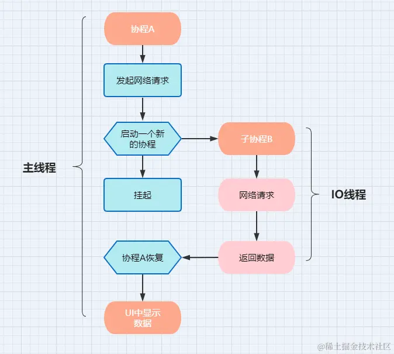

reference: https://juejin.cn/post/6987724340775108622

## 协程概念

-------------
本质上协程就是作为在Kotlin语言上进行异步变成的解决方案，处理异步代码的方法。可以使用阻塞的方式写出非阻塞的代码。
可以像RxJava一样有效地消除回调地狱（场景说明：任务A执行耗时任务，任务B依赖于任务A的执行结果，任务C依赖于任务B的执行结果...
普通方法：等待任务A执行完通过回调返回结果，然后执行任务B，通过回调返回结果，然后执行任务 C...）。

但是在写法上协程和普通的顺序代码类似，同步的方法去编写异步执行的代码。【非阻塞式挂起】

作用：
1.	协程可以让异步代码同步化；
2.	协程可以降低异步程序的设计复杂度。 
3. 
特点：
1.	轻量
2.	内存泄漏更少
3.	支持内存取消
4.	Jetpack集成

## 原理

-------------
函数或者一段程序能够被挂起，稍后再在挂起的位置恢复。

### 安卓平台上，主要使用场景：
1.	线程切换，保证线程安全
2.	处理耗时任务（网络请求，解析JSON，从数据库中读写数据等）

### 对比代码
```kotlin
val call: Call<User> = userApi.getUserInfo("Jack")

call.enqueue(object : Callback<User> {
    //成功
    override fun onResponse(call: Call<User>, response: Response<User>) {
        val result = response.body()
        result?.let { showUser(result) }
    }
    //失败
    override fun onFailure(call: Call<User>, t: Throwable) {
        showError(t.message)
    }
})
```

```kotlin
GlobalScope.launch(Dispatchers.Main) {//开始协程：主线程
    val result = userApi.getUserSuspend("Jack")//网络请求（IO 线程）
    tv_name.text = result?.name //更新 UI（主线程）
}
```

【非阻塞式挂起】
### 典型业务流程 
主线程 -> suspend -> IO线程 -> resume -> 主线程

协程Coroutine虽然不能脱离线程而运行，但是可以在不同的线程之间切换，而且一个线程可以跑一个或多个协程。

## 基础
### 启动协程
三部分：GlobalScope, launch, Dispatchers。即协程的作用域、构建器和调度器

### 协程的构建
协程构造器（Builders），负责常见协程：
1. runBlocking:T --------------顶级函数，创建一个新的协程，同时阻塞当前线程，直到其内部所有逻辑以及子协程所有逻辑全部执行完成。返回值为泛型T，一般在项目中不会使用，主要是为了main还是和测试设计的。
2. launch -------------- 创建一个新的协程，不会阻塞当前线程，必须在协程作用域中才可以调用。它返回的是一个该协程任务的引用，即Job对象。这是最常用的用于启动协程的方式。
3. async -------------- 创建一个新的协程，不会阻塞当前线程，必须在协程作用域中才可以调用。并返回Deffer对象，可通过调用Deffer.await()方法等待该子协程执行完成并获取结果。常用于并发执行-同步等待和获取返回值的情况。

#### runBlocking
注：runBlocking虽然会阻塞当前线程，但其内部运行的协程又是非阻塞的
#### launch
最常用于启动协程的方式，用于在不阻塞当前线程的情况下启动一个协程，并返回对该协程任务的引用，即Job对象
#### async

